# Architecture

## System Overview

```mermaid
graph LR
    A[Client] -->|HTTP POST| B[Backend API]
    B -->|Insert| C[(Postgres)]
    B -->|Protobuf| D[Vector]
    D -->|Decode & Route| E[Kafka]
    E -->|Stream| F[ClickHouse Kafka Engine]
    F -->|Materialized View| G[(ClickHouse MergeTree)]
    H[Dashboard] -->|Query| G
    A -->|View| H
    
    style B fill:#3b82f6
    style C fill:#336791
    style D fill:#ff6600
    style E fill:#231f20
    style F fill:#ffcc00
    style G fill:#ffcc00
    style H fill:#000000
```



## Component Responsibilities

### 1. Backend API (Node.js + TypeScript)
- **Purpose**: Order creation and management
- **Technology**: Express, pg (PostgreSQL client), protobufjs
- **Responsibilities**:
  - Accept REST API requests
  - Validate order data
  - Insert into Postgres (with transactions)
  - Encode orders as Protobuf messages
  - Send events to Vector HTTP endpoint
  
### 2. PostgreSQL
- **Purpose**: Persistent order and user storage
- **Technology**: PostgreSQL 15
- **Schema**:
  - `users` table: user profiles
  - `orders` table: order records with foreign key to users
  - Indexes on user_id, status, created_at
  
### 3. Protobuf
- **Purpose**: Efficient binary serialization
- **Schema**: OrderEvent message with 5 fields
- **Benefits**:
  - Smaller payload size vs JSON
  - Strong typing
  - Language-agnostic

### 4. Vector
- **Purpose**: Stream processing and routing
- **Technology**: Vector v0.35+
- **Pipeline**:
  1. HTTP source receives protobuf bytes
  2. Decode protobuf using schema
  3. Transform to JSON
  4. Route to Kafka topic
  5. DLQ for failed messages
  
### 5. Apache Kafka
- **Purpose**: Event streaming buffer
- **Technology**: Confluent Kafka 7.5
- **Configuration**:
  - Topic: `order_events`
  - Partitions: 3 (for parallelism)
  - Replication: 1 (demo setup)
  - Retention: 7 days
  
### 6. ClickHouse
- **Purpose**: Real-time analytics database
- **Tables**:
  - **Kafka Engine Table**: Consumes from Kafka
  - **MergeTree Table**: Persistent analytics storage
  - **Materialized View**: Real-time ingestion pipeline
  - **Aggregation Tables**: Pre-computed metrics
  
### 7. Dashboard (Next.js 14)
- **Purpose**: Real-time data visualization
- **Technology**: Next.js, Recharts, Tailwind CSS
- **Features**:
  - Server-side API routes query ClickHouse
  - Client-side components with auto-refresh
  - Responsive design
  - Live metrics and charts

## Data Flow Details

### Order Creation Flow
```
1. Client → POST /api/orders → Backend
2. Backend → BEGIN TRANSACTION → Postgres
3. Backend → INSERT user → Postgres
4. Backend → INSERT order → Postgres
5. Backend → COMMIT → Postgres
6. Backend → Encode Protobuf → Event
7. Backend → HTTP POST → Vector:8686
```

### Streaming Pipeline Flow
```
1. Vector → Receive bytes → HTTP:8686
2. Vector → Decode protobuf → OrderEvent
3. Vector → Transform → JSON
4. Vector → Produce → Kafka:order_events
5. ClickHouse → Consume → Kafka Engine Table
6. ClickHouse → INSERT → MergeTree (via MV)
```

### Dashboard Query Flow
```
1. Dashboard → /api/stats → Next.js API Route
2. API Route → ClickHouse Client → Query
3. ClickHouse → Aggregate → Result
4. API Route → JSON → Dashboard
5. Dashboard → Recharts → Render
```

## Scalability Considerations

### Horizontal Scaling
- **Backend**: Stateless, can run multiple replicas
- **Kafka**: Add more partitions and brokers
- **ClickHouse**: Use distributed tables and clusters
- **Vector**: Deploy multiple instances

### Vertical Scaling
- **Postgres**: Increase connection pool size
- **ClickHouse**: More RAM for better aggregation performance
- **Kafka**: Increase partition replicas

### Performance Optimizations
- **ClickHouse**: Partitioning by date, proper ORDER BY
- **Kafka**: Compression (snappy)
- **Vector**: Batching and buffering
- **Backend**: Connection pooling, async event emission

## High Availability

### Database HA
- Postgres: Master-replica replication
- ClickHouse: ClickHouse Keeper + replicas
- Kafka: Multi-broker cluster with RF > 1

### Service HA
- Load balancer for backend
- Multiple Vector instances
- Kubernetes for orchestration

## Monitoring

### Metrics to Track
- Order creation rate (orders/sec)
- Event processing lag (Vector → Kafka → ClickHouse)
- ClickHouse query performance
- Dashboard API response times
- Resource utilization (CPU, RAM, disk)

### Logs
- Backend: Order creation, errors
- Vector: Processing errors, DLQ
- ClickHouse: Kafka consumer lag
- Kafka: Broker health

## Security

### Current (Demo)
- No authentication
- Plain HTTP
- Default passwords

### Production Recommendations
- TLS everywhere (HTTPS, Kafka SSL)
- Authentication for all services
- API rate limiting
- Network segmentation
- Secrets management (Vault)
- Role-based access control

## Technology Choices

### Why Node.js for Backend?
- Easy protobuf integration
- Good Postgres client libraries
- Async/await for non-blocking I/O

### Why Vector?
- Native protobuf support
- Powerful transformation capabilities
- Battle-tested in production

### Why Kafka?
- Industry standard for event streaming
- Durability and replay capability
- Scalable and fault-tolerant

### Why ClickHouse?
- Excellent for OLAP workloads
- Native Kafka integration
- Fast aggregations and analytics
- Materialized views for real-time ETL

### Why Next.js?
- Server-side rendering
- API routes for backend logic
- Great developer experience
- Built-in optimization

## Deployment

### Local Development
- Docker Compose (current)
- All services on localhost

### Staging/Production
- Kubernetes (recommended)
- Helm charts for each service
- Persistent volumes for databases
- Horizontal pod autoscaling
- Ingress for external access

### Cloud Options
- **Managed Postgres**: AWS RDS, Cloud SQL
- **Managed Kafka**: Confluent Cloud, AWS MSK
- **Managed ClickHouse**: ClickHouse Cloud
- **Container Orchestration**: EKS, GKE, AKS
