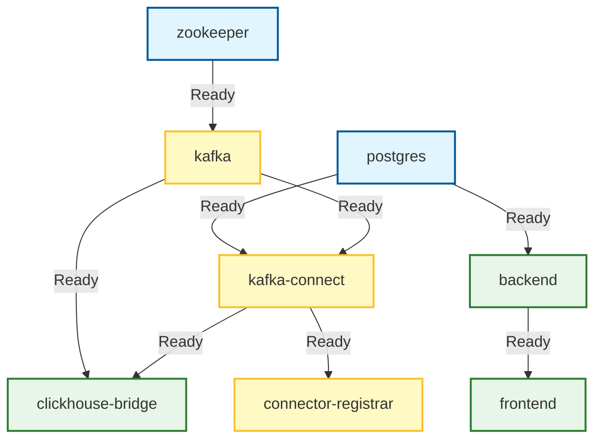
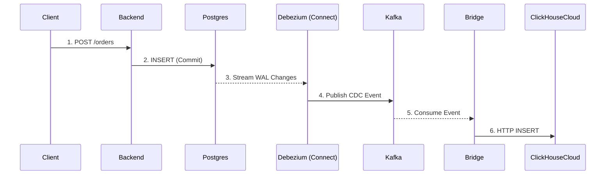

# Luồng Khởi Động & Vai Trò Services (Docker Compose)

Dưới đây là biểu đồ luồng khởi động (Initialization Flow) và giải thích vai trò chi tiết của từng container trong hệ thống.

## 1. Biểu Đồ Luồng Khởi Động (Startup Flow)

Hệ thống khởi động theo thứ tự phụ thuộc (dependencies) được định nghĩa trong `docker-compose.yml`.

### Giải Thích Thứ Tự:

1.  **Tầng 1 (Cơ sở)**: `zookeeper` và `postgres` khởi động đầu tiên vì chúng không phụ thuộc ai.
2.  **Tầng 2 (Middleware)**:
    *   `kafka` khởi động sau khi `zookeeper` sẵn sàng.
    *   `backend` khởi động sau khi `postgres` sẵn sàng.
3.  **Tầng 3 (Integration)**:
    *   `kafka-connect` khởi động sau khi cả `kafka` và `postgres` đều sẵn sàng.
4.  **Tầng 4 (Ứng dụng & Bridge)**:
    *   `clickhouse-bridge` khởi động sau khi `kafka-connect` sẵn sàng.
    *   `connector-registrar` chạy script đăng ký sau khi `kafka-connect` sẵn sàng.
    *   `frontend` khởi động sau cùng (hoặc song song) khi `backend` đã chạy.

---

## 2. Vai Trò Chi Tiết Từng Container

| Container | Vai Trò Chính | Nhiệm Vụ Cụ Thể |
|-----------|---------------|-----------------|
| **`postgres`** | **Source Database** | • Lưu trữ dữ liệu chính (`orders`, `users`). • Ghi Write-Ahead Log (WAL) để Debezium đọc. • Nơi Backend ghi dữ liệu vào. |
| **`zookeeper`** | **Coordinator** | • Quản lý trạng thái của Kafka Cluster. • Lưu metadata về topics, partitions. |
| **`kafka`** | **Message Broker** | • Trung chuyển dữ liệu. • Lưu trữ các CDC events từ Debezium. • Nơi `clickhouse-bridge` đọc dữ liệu. |
| **`kafka-connect`** | **CDC Runtime** | • Môi trường chạy Debezium Connector. • Kết nối tới Postgres để đọc WAL. • Chuyển đổi WAL thành JSON events và gửi vào Kafka. |
| **`connector-registrar`** | **Setup Tool** | • Container ngắn hạn (ephemeral). • Chờ Kafka Connect sẵn sàng rồi chạy script `curl` để đăng ký cấu hình connector. • Giúp tự động hóa việc setup. |
| **`clickhouse-bridge`** | **Sync Service** | • Service Node.js tự viết. • Subscribe vào Kafka topics (`orderserver.public.orders`). • Transform dữ liệu và gọi API `INSERT` vào ClickHouse Cloud. |
| **`backend`** | **API Server** | • Xử lý logic nghiệp vụ. • Cung cấp API tạo đơn hàng (`POST /api/orders`). • Chỉ giao tiếp với Postgres (không biết về Kafka/ClickHouse). |
| **`frontend`** | **Dashboard UI** | • Hiển thị biểu đồ, thống kê. • Query dữ liệu trực tiếp từ ClickHouse Cloud để hiển thị báo cáo Real-time. |

---

## 3. Luồng Dữ Liệu (Data Flow) Khi Hệ Thống Chạy

