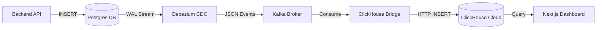

# 🚀 End-to-End CDC Streaming Demo Project

A complete real-time data pipeline demonstrating **Change Data Capture (CDC)** from Postgres to ClickHouse Cloud using Debezium and Kafka.

## 📊 Architecture



### Data Flow

1.  **Backend Service**: Creates orders in Postgres (standard SQL INSERT).
2.  **Postgres**: Stores data and writes to Write-Ahead Log (WAL).
3.  **Debezium**: Reads WAL changes via logical replication and streams them to Kafka.
4.  **Kafka**: Buffers CDC events as JSON messages.
5.  **ClickHouse Bridge**: Consumes events from Kafka and inserts them into ClickHouse Cloud.
6.  **Next.js Dashboard**: Queries ClickHouse Cloud for real-time analytics.

## 🎯 Features

✅ **CDC Pipeline**: Zero-code data capture from Postgres  
✅ **Reliable Streaming**: Debezium + Kafka ensures data integrity  
✅ **ClickHouse Cloud**: Serverless real-time analytics  
✅ **Live Dashboard**: Auto-refreshing metrics  
✅ **Docker Compose**: One-command deployment  
✅ **Load Testing**: Bulk order generation tools  

## 📁 Project Structure

```
streaming-demo/
├── backend/              # Node.js order service (Source)
├── clickhouse-bridge/    # Kafka to ClickHouse Cloud sync service
├── debezium/             # Connector configuration & scripts
├── frontend/             # Next.js dashboard (Visualization)
├── postgres/             # Database config (WAL enabled)
├── docker-compose.yml    # Orchestration
└── start.sh              # Automated startup script
```

## 🚦 Quick Start

### Prerequisites

- Docker Desktop (4GB+ RAM recommended)
- Ports: 3000, 3001, 5432, 9092, 8083

### 1. Start the System

We provide a helper script to automate the setup:

```bash
./start.sh
```

This script will:
1.  Clean up old containers
2.  Build and start all services
3.  Wait for services to be healthy
4.  Automatically register the Debezium connector

### 2. Verify Data Flow

**Create Orders (Backend):**
```bash
curl -X POST "http://localhost:3001/api/orders/bulk?count=10"
```

**Check Postgres:**
```bash
docker exec streaming-postgres psql -U postgres -d orders_db -c "SELECT count(*) FROM orders;"
```

**Check ClickHouse Cloud:**
```bash
# Data should appear automatically within seconds!
```

**View Dashboard:**
Open [http://localhost:3000](http://localhost:3000)

## 📡 API Endpoints

### Backend API (Port 3001)

| Method | Endpoint | Description |
|--------|----------|-------------|
| POST | `/api/orders` | Create single order |
| POST | `/api/orders/bulk?count=N` | Create N orders (bulk) |
| GET | `/api/orders` | Get recent orders (Postgres) |

### Dashboard API (Port 3000)

| Endpoint | Description |
|----------|-------------|
| `/api/stats` | Real-time stats from ClickHouse |
| `/api/revenue` | Revenue charts |
| `/api/realtime` | Live order stream |

## 🔧 Configuration

### Environment Variables

**Backend (.env)**
```env
POSTGRES_HOST=postgres
POSTGRES_USER=postgres
POSTGRES_PASSWORD=postgres
POSTGRES_DB=orders_db
```

**ClickHouse Bridge**
Configured in `docker-compose.yml`:
- `KAFKA_BROKERS`: Kafka connection
- `CLICKHOUSE_URL`: ClickHouse Cloud endpoint
- `CLICKHOUSE_USER`: Cloud username
- `CLICKHOUSE_PASSWORD`: Cloud password

## 📝 Technology Stack

| Component | Technology | Purpose |
|-----------|-----------|---------|
| **Source DB** | PostgreSQL 15 | Transactional Data |
| **CDC Tool** | Debezium 2.5 | Change Data Capture |
| **Broker** | Apache Kafka | Event Streaming |
| **Sync Service** | Node.js | Kafka to ClickHouse Bridge |
| **Analytics DB** | ClickHouse Cloud | Real-time OLAP |
| **Dashboard** | Next.js 14 | Visualization |

## 📚 Documentation

Detailed documentation (Vietnamese):
- [GUIDE-VI.md](./GUIDE-VI.md): Full Technical Guide
- [QUICKSTART-VI.md](./QUICKSTART-VI.md): Quick Start Guide
- [DOCKER-INIT-FLOW-VI.md](./DOCKER-INIT-FLOW-VI.md): Startup Flow & Architecture
- [KAFKA-PUBLISH-FLOW-VI.md](./KAFKA-PUBLISH-FLOW-VI.md): Deep Dive into CDC Flow
